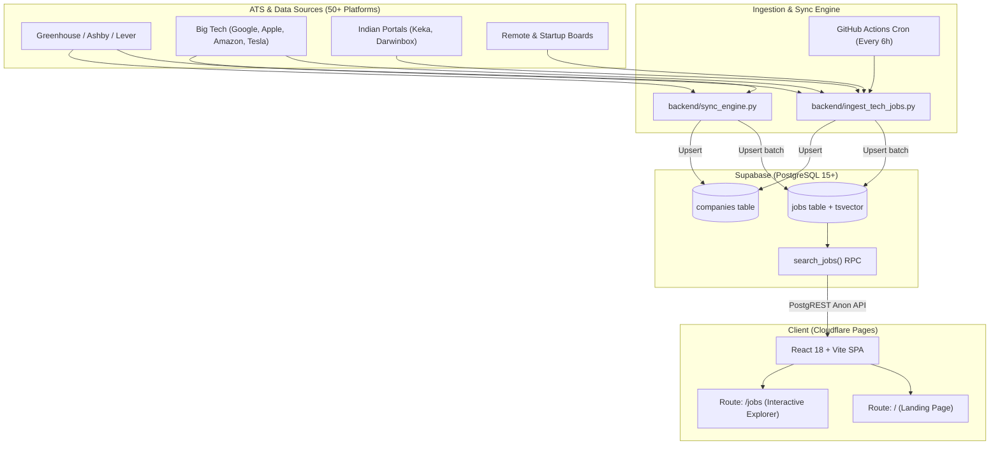

# Jobs Hive 💼⚡

[](https://react.dev/)
[](https://vitejs.dev/)
[](https://tailwindcss.com/)
[](https://supabase.com/)
[](https://www.python.org/)
[](https://github.com/features/actions)
[](https://pages.cloudflare.com/)
[](LICENSE)

**Jobs Hive** is a modern, full-stack tech job discovery engine and aggregator. It automatically extracts, cleans, deduplicates, and surfaces verified tech roles across **50+ Applicant Tracking Systems (ATS)**, top tech giants, high-growth startups, and GCCs—powered by automated scheduled scrapers, PostgreSQL full-text search, and an interactive React web application.

---

## 📑 Table of Contents

- [🌟 Key Features](#-key-features)
- [🏗️ System Architecture](#️-system-architecture)
- [📁 Repository Structure](#-repository-structure)
- [🛠️ Tech Stack](#️-tech-stack)
- [🚀 Getting Started (Local Development)](#-getting-started-local-development)
  - [1. Prerequisites](#1-prerequisites)
  - [2. Clone Repository](#2-clone-repository)
  - [3. Supabase Database Setup](#3-supabase-database-setup)
  - [4. Backend Ingestion Pipeline](#4-backend-ingestion-pipeline)
  - [5. Frontend Application](#5-frontend-application)
- [🗄️ Database Schema & Search Engine](#️-database-schema--search-engine)
- [🔄 Automated Cron Pipeline (GitHub Actions)](#-automated-cron-pipeline-github-actions)
- [☁️ Production Deployment](#️-production-deployment)
- [🔐 Environment Variables](#-environment-variables)
- [🤝 Contributing](#-contributing)
- [📄 License](#-license)

---

## 🌟 Key Features

- ⚡ **Multi-ATS Ingestion Engine**:
  - Ingests tech jobs across **50+ platforms**:
    - **Core ATS**: Greenhouse, Ashby, Lever, Workday, SmartRecruiters, BambooHR, Rippling, Recruitee, Teamtailor, Workable.
    - **Startup & Remote Portals**: Y Combinator, Wellfound, WeWorkRemotely, RemoteOK, BuiltIn.
    - **Custom Big-Tech Scrapers**: Google, Apple, Amazon, Tesla, Uber, ByteDance/TikTok.
    - **Indian Tech Platforms**: Keka, Darwinbox.
  - Automated tech role detection (Software, Backend, Frontend, Full Stack, DevOps, AI/ML, Cloud, Mobile, QA, Security, Data).
  - Geographic filtering for India & Remote worldwide opportunities.
  - Built-in deduplication by `global_id` and automatic pruning of stale postings older than 30 days.

- 🔍 **High-Performance PostgreSQL Search**:
  - `pg_trgm` (trigram) and `tsvector` weighted full-text search across Title (Weight A), Company (Weight B), Location (Weight C), and Department (Weight D).
  - PL/pgSQL RPC function (`search_jobs`) supporting instant keyword rank, salary sorting, and multi-facet filtering.

- 🎨 **Modern, High-Converting Frontend**:
  - **Landing Page (`/`)**: Hero search, live company ticker, featured roles, value proposition cards, platform statistics, and email call to action.
  - **Job Explorer (`/jobs`)**:
    - Split-screen layout with interactive cards and quick-preview drawer.
    - Instant filters: Remote/Workplace type, Employment type (Full-time, Contract, Internship), Location, Salary, and Experience.
    - Bidirectional URL parameter synchronization (`?q=`, `?workplace=`, `?emp_type=`, `?location=`) for shareable search links.
    - Curated fallback dataset ensuring zero downtime during API transitions.

- 🤖 **Zero-Maintenance Automation**:
  - GitHub Actions workflow running every 6 hours (`0 */6 * * *`) with manual trigger support and dry-run preview mode.
  - 100% free-tier serverless stack (Cloudflare Pages + Supabase Free + GitHub Actions).

---

## 🏗️ System Architecture



---

## 📁 Repository Structure

```text
.
├── .github/
│   └── workflows/
│       └── sync_jobs.yml         # Scheduled GitHub Actions workflow (runs every 6h)
├── ats-scrapers/                 # Modular ATS scraping engine and parsers
│   ├── src/ats_scrapers/         # ATS adapters (greenhouse, ashby, lever, workday, etc.)
│   └── pyproject.toml            # Scraper library configuration
├── backend/
│   ├── schema.sql                # Supabase PostgreSQL schema, indexes, RLS, & search RPC
│   ├── seed_companies.py         # Curated list of top tech companies for initial seed
│   ├── ingest_tech_jobs.py       # Main ingestion, role classification & cleanup script
│   ├── sync_engine.py            # Multi-source company sync engine
│   └── requirements.txt          # Python dependencies (supabase, httpx, pandas, etc.)
├── frontend/
│   ├── public/
│   │   ├── _redirects            # Cloudflare Pages SPA rewrite rule (/* /index.html 200)
│   │   └── assets/logos/         # Brand and company SVGs
│   ├── src/
│   │   ├── components/
│   │   │   ├── landing/          # LandingNavbar, HeroSection, TrustedCompanies, etc.
│   │   │   ├── Header.jsx        # App navigation & instant search input
│   │   │   ├── FilterBar.jsx     # Filter pills and mobile filter trigger
│   │   │   ├── FilterModal.jsx   # Multi-facet filter modal for mobile & desktop
│   │   │   ├── JobCard.jsx       # Responsive job listing card
│   │   │   ├── JobDetail.jsx     # Side-drawer job details and direct apply modal
│   │   │   └── Pagination.jsx    # Page navigation controls
│   │   ├── pages/
│   │   │   ├── LandingPage.jsx   # High-converting landing page (Route: /)
│   │   │   └── JobsPage.jsx      # Job discovery engine (Route: /jobs)
│   │   ├── services/
│   │   │   └── supabaseClient.js # Supabase client singleton & query definitions
│   │   ├── data/
│   │   │   ├── curatedJobs.js    # Curated fallback data for offline resilience
│   │   │   └── brandLogos.jsx    # SVG icons for companies and platforms
│   │   ├── App.jsx               # React Router configuration
│   │   ├── main.jsx              # React DOM entry point
│   │   └── index.css             # Tailwind styling and typography
│   ├── package.json              # Frontend dependencies and scripts
│   ├── tailwind.config.js        # Tailwind CSS theme extension
│   └── vite.config.js            # Vite build configuration (Port 3000)
├── AGENTS.md                     # Workspace guidelines & rules
└── README.md                     # Project documentation
```

---

## 🛠️ Tech Stack

| Layer | Technologies |
| :--- | :--- |
| **Frontend** | React 18, Vite 6, Tailwind CSS 3.4, React Router DOM v7, Lucide React, React Markdown |
| **Backend** | Python 3.12, Supabase Python Client, HTTPX, Pandas, PyArrow |
| **Database** | PostgreSQL 15+ (Supabase), `pg_trgm`, `tsvector` Full-Text Search, Row Level Security (RLS) |
| **Scraping Engine**| `ats-scrapers`, Parquet ingestion pipeline, Direct API connectors |
| **CI / CD** | GitHub Actions (Ingestion Cron) |
| **Hosting** | Cloudflare Pages (Frontend SPA) |

---

## 🚀 Getting Started (Local Development)

### 1. Prerequisites

- **Node.js**: v18.0.0 or higher ([Download](https://nodejs.org/))
- **Python**: v3.10 to v3.12 ([Download](https://www.python.org/))
- **Git**: Installed and configured
- **Supabase Account**: A free project at [supabase.com](https://supabase.com)

---

### 2. Clone Repository

```bash
git clone https://github.com/vinay-0913/Jobs-Hive.git
cd Jobs-Hive
```

---

### 3. Supabase Database Setup

1. Log into your **Supabase Dashboard** and create a new project.
2. Navigate to **SQL Editor** $\rightarrow$ **New Query**.
3. Open `backend/schema.sql` from this repository, copy its entire contents, paste it into the editor, and click **Run**.
4. This will set up:
   - `pg_trgm` extension
   - `companies` table (with ATS tracking and unique constraints)
   - `jobs` table (with stored `tsvector` full-text search column)
   - GIN indexes on title, company, active flags, and timestamps
   - Row Level Security (RLS) policies allowing public read access
   - `search_jobs()` custom database function

---

### 4. Backend Ingestion Pipeline

Navigate to the `backend` folder and create a Python virtual environment:

```bash
cd backend

# Create virtual environment
python -m venv .venv

# Activate virtual environment
# Windows (PowerShell):
.venv\Scripts\Activate.ps1
# Windows (CMD):
.venv\Scripts\activate.bat
# macOS / Linux:
source .venv/bin/activate

# Install dependencies
pip install -r requirements.txt
```

#### Configure Environment Variables

Create a `.env` file inside `backend/`:

```env
SUPABASE_URL=https://<your-project-ref>.supabase.co
SUPABASE_SERVICE_KEY=your-supabase-service-role-key
```

> [!CAUTION]
> Use the **service_role** key for the backend ingestion pipeline so it has write access to bypass RLS. Never commit this file or expose this key in client-side code.

#### Seed Initial Companies

Seed the curated list of top tech companies (Stripe, OpenAI, Airbnb, Netflix, Google, Apple, etc.):

```bash
python seed_companies.py
```

#### Run Job Ingestion

```bash
# Preview what would be ingested without writing to DB (Dry Run)
python ingest_tech_jobs.py --dry-run

# Run full ingestion across all supported ATS platforms
python ingest_tech_jobs.py

# Ingest a specific ATS platform only (e.g. greenhouse, ashby, lever)
python ingest_tech_jobs.py --ats greenhouse
```

---

### 5. Frontend Application

Open a new terminal window and navigate to `frontend`:

```bash
cd frontend

# Install Node dependencies
npm install

# Start local Vite development server
npm run dev
```

Visit **`http://localhost:3000`** in your browser:
- **`http://localhost:3000/`** $\rightarrow$ Modern Landing Page
- **`http://localhost:3000/jobs`** $\rightarrow$ Job Discovery Explorer

To build for production:

```bash
npm run build
npm run preview
```

---

## 🗄️ Database Schema & Search Engine

### Primary Tables

#### `companies`
Tracks targeted companies and their respective ATS platforms:
- `id` (UUID, Primary Key)
- `name` (TEXT)
- `slug` (TEXT)
- `ats` (TEXT, e.g. `greenhouse`, `ashby`, `lever`)
- `careers_url` (TEXT)
- `is_active` (BOOLEAN)
- `last_synced_at` (TIMESTAMPTZ)

#### `jobs`
Stores normalized job listings with full-text search vectors:
- `id` (UUID, Primary Key)
- `global_id` (TEXT UNIQUE) — Ensures deduplication across sync runs
- `title` (TEXT)
- `company_name` (TEXT)
- `ats_type` (TEXT)
- `url` / `apply_url` (TEXT)
- `location` (TEXT) & `country_iso` (TEXT)
- `is_remote` (BOOLEAN)
- `salary_min`, `salary_max`, `salary_currency`, `salary_period`
- `department`, `team`, `employment_type`, `experience`
- `description` (TEXT)
- `posted_at`, `first_seen_at`, `is_active`
- `fts` (`TSVECTOR GENERATED ALWAYS`) — Weighted full-text search column

### Custom Search Function: `search_jobs()`

The frontend calls a database RPC function designed for low latency search:

```sql
SELECT * FROM search_jobs(
    search_query => 'react engineer',
    filter_remote => true,
    filter_employment_type => 'Full-time',
    filter_salary_min => 80000,
    filter_company => 'Stripe',
    filter_country => 'IN',
    sort_by => 'posted_at',
    sort_order => 'desc',
    page_size => 20,
    page_offset => 0
);
```

---

## 🔄 Automated Cron Pipeline (GitHub Actions)

The scheduled pipeline located in [`.github/workflows/sync_jobs.yml`](.github/workflows/sync_jobs.yml) keeps the database updated without running dedicated servers.

### Schedule
Runs automatically every **6 hours** via GitHub Actions:
```yaml
on:
  schedule:
    - cron: '0 */6 * * *'
  workflow_dispatch:
    inputs:
      ats:
        description: 'Optional: specific ATS to sync (e.g. greenhouse)'
      dry_run:
        description: 'Dry run (no DB writes)'
        type: boolean
        default: false
```

### Required Secrets
To enable the automated workflow:
1. Go to your GitHub repository $\rightarrow$ **Settings** $\rightarrow$ **Secrets and variables** $\rightarrow$ **Actions**.
2. Click **New repository secret** and add:
   - `SUPABASE_URL`: Your Supabase Project URL (`https://<project-ref>.supabase.co`)
   - `SUPABASE_SERVICE_KEY`: Your private Supabase `service_role` key

---

## ☁️ Production Deployment

### Deploying Frontend to Cloudflare Pages (Recommended)

1. Push your repository to GitHub:
   ```bash
   git add .
   git commit -m "feat: complete Jobs Hive platform"
   git push origin main
   ```
2. In the [Cloudflare Dashboard](https://dash.cloudflare.com/):
   - Go to **Workers & Pages** $\rightarrow$ **Create application** $\rightarrow$ **Pages** $\rightarrow$ **Connect to Git**.
   - Select your repository (`Jobs-Hive`).
   - Configure build settings:
     - **Framework preset**: `Vite`
     - **Root directory**: `frontend`
     - **Build command**: `npm run build`
     - **Build output directory**: `dist`
3. Click **Save and Deploy**.

> [!NOTE]
> The repository includes `frontend/public/_redirects` (`/* /index.html 200`) which enables seamless HTML5 client-side routing on Cloudflare Pages so that bookmarked URLs like `/jobs` load without 404 errors.

---

## 🔐 Environment Variables

### Backend (`backend/.env`)

| Variable | Description | Example |
| :--- | :--- | :--- |
| `SUPABASE_URL` | Supabase Project URL | `https://xyzcompany.supabase.co` |
| `SUPABASE_SERVICE_KEY` | Private Supabase `service_role` secret key | `eyJhbGciOi...` |

### Frontend (`frontend/src/services/supabaseClient.js`)

| Variable | Description | Security Level |
| :--- | :--- | :--- |
| `SUPABASE_URL` | Supabase Project API endpoint | Public (`anon`) |
| `SUPABASE_ANON_KEY` | Public Supabase anon client key | Public (Restricted by RLS) |

---

## 🤝 Contributing

Contributions, issues, and feature requests are welcome!

1. Fork the Project (`https://github.com/vinay-0913/Jobs-Hive/fork`)
2. Create your Feature Branch (`git checkout -b feature/AmazingFeature`)
3. Commit your Changes (`git commit -m 'Add some AmazingFeature'`)
4. Push to the Branch (`git push origin feature/AmazingFeature`)
5. Open a Pull Request

---

## 📄 License

Distributed under the **MIT License**. See [`LICENSE`](ats-scrapers/LICENSE) for details.
